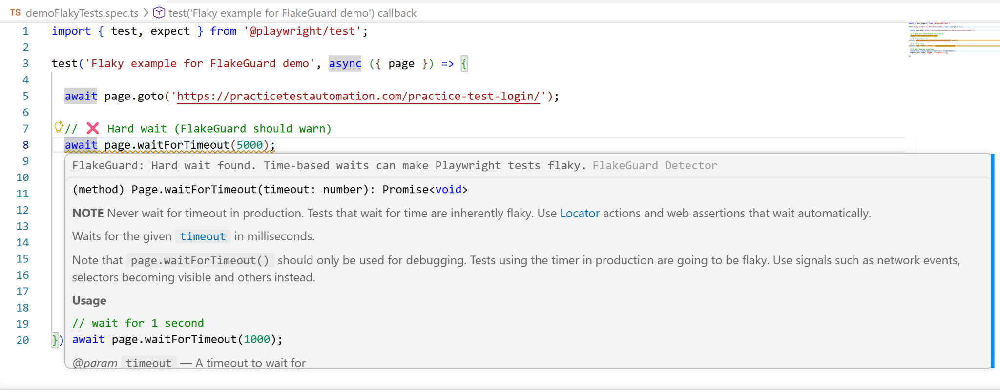
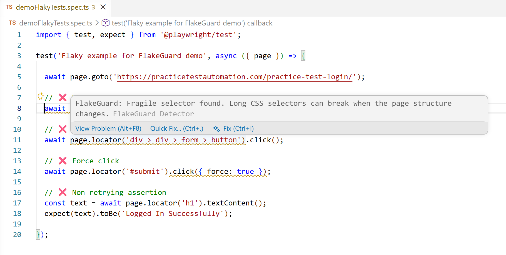

# FlakeGuard Detector
🔗 Install from VS Code Marketplace: https://marketplace.visualstudio.com/items?itemName=abhisheksahu-qa.flakeguard-detector

⭐ If this helps you, please consider starring the repo

FlakeGuard Detector is a VS Code extension that helps identify flaky patterns in Playwright tests.

It identifies common patterns that lead to flaky tests directly inside the editor, such as hard waits, fragile selectors, nth-child usage, force clicks, and non-retrying assertions.

These issues often go unnoticed during development but cause failures later in CI. FlakeGuard helps catch them early and suggests safer alternatives.

It works without running tests and focuses on preventing flaky behavior at the time of writing test code.

---

## Why it matters
This helps reduce test failures in CI and improves overall test reliability.

---

## Where this is useful

This is especially useful in Playwright test suites where tests pass locally but fail in CI due to timing issues, unstable selectors, or DOM changes.

FlakeGuard helps identify these problems early while writing tests, reducing debugging time and improving overall test reliability.

---

## How to use

1. Install the extension from VS Code Marketplace  
2. Open any Playwright test file (`.spec.ts`, `.test.ts`, `.js`, `.ts`)
3. FlakeGuard will highlight risky patterns directly in the editor
4. Use:
   - `Ctrl + .` for Quick Fix  
   - Hover to see explanation
5. Follow suggestions to improve test stability
   
---

## What problem this solves

Flaky tests are a common issue in test automation.

Patterns like hard waits, fragile selectors, or non-retrying checks often pass locally but fail in CI.

FlakeGuard highlights these patterns early, before they become debugging issues.

---

## What it does

FlakeGuard scans Playwright test files and looks for patterns that usually lead to flaky behavior.

It currently detects:

- Hard waits using `waitForTimeout`
- Long or structure-based CSS selectors
- `nth-child` selectors
- Force clicks (`force: true`)
- Assertions that do not retry

---

## How it helps

- Shows warnings directly in the editor
- Explains why a pattern may be flaky
- Suggests safer alternatives
- Provides quick fixes
- Generates a simple file-level summary

---

## Example (real scenario)

### Before

```ts
await page.waitForTimeout(5000);
await page.locator('div > div > span > button').click();
expect(await button.isVisible()).toBe(true);

### After
```ts
await expect(page.getByRole('button', { name: 'Submit' })).toBeVisible();
await page.getByRole('button', { name: 'Submit' }).click();
await expect(button).toBeVisible();

## Hard wait detection

FlakeGuard detects time-based waits like `waitForTimeout`, which can cause flaky tests:




## Example in VS Code

FlakeGuard highlights flaky patterns directly in the editor:



---

## What makes this different

FlakeGuard works directly inside the editor and focuses on detecting flaky patterns while writing test code.

It does not rely on running tests or analyzing failures later. The goal is to catch issues early, before they become CI failures.

---

## Flakiness summary

FlakeGuard provides a simple summary of issues in a file.

Use command palette:
FlakeGuard: Show Flakiness Summary

This helps quickly understand how many potential flaky patterns exist in a test file.

---

## Notes
FlakeGuard is focused on early detection inside the IDE.
It does not run tests or depend on test execution.
The goal is to catch common issues while writing code.

---

## Feedback

If you find this useful or have suggestions, feel free to open an issue or share feedback.

⭐ Star the repo if it helped you.

---

## License

MIT
